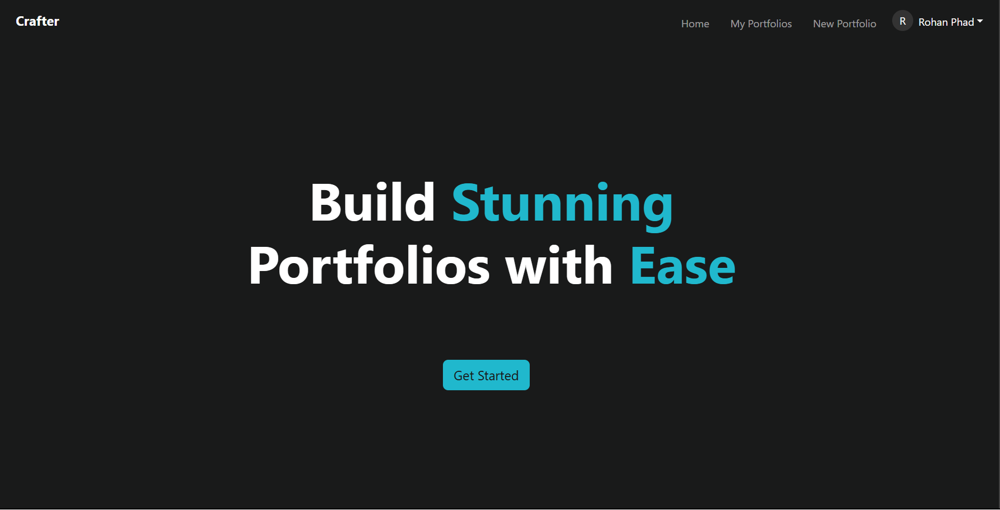
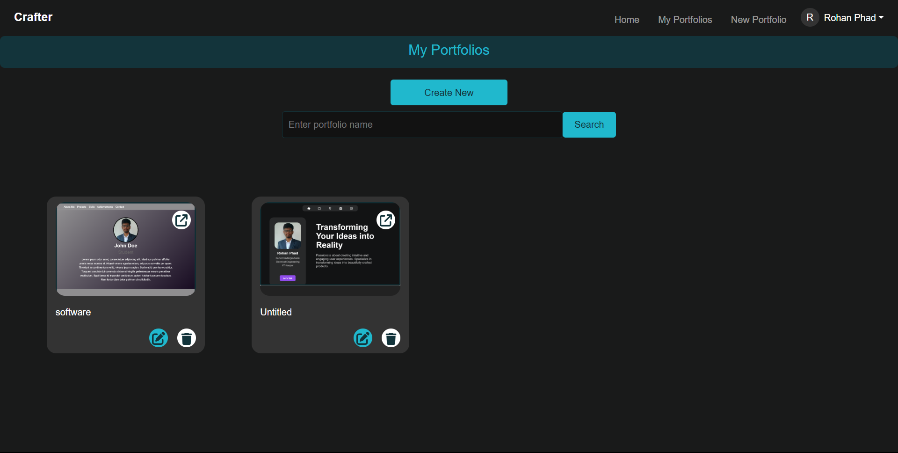
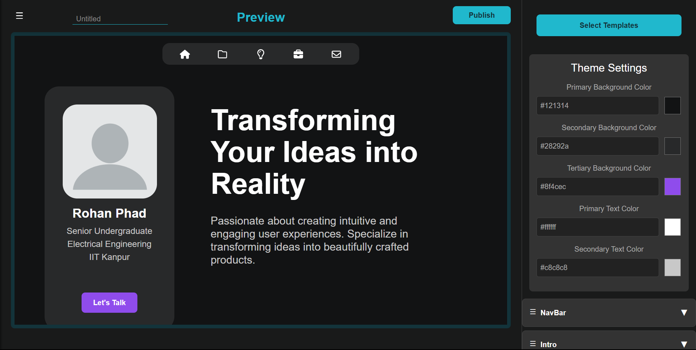

# Crafter
A digital portfolio builder web app

## Description

Crafter is a web application which allows users to build and publish portfolios using highly customizable templates. 

## Features

1. Highly customizable templates
2. Support for image embeddings
3. Uniquely generated link for each portfolio
4. Secure user authentication and authorization using google OAuth
5. Simple and intuitive User Interface

## Technologies Used

1. ReactJS
2. NodeJS ( ExpressJS )
3. MongoDB
4. PassportJS

## Photos

1. Homepage

2. My Portfolios page

3. Create portfolio page


## Installation guide 

### Step 1 
Clone the repository to your local machine using Git.

```bash
git clone https://github.com/rohanphad/Crafter
```

### Step 2
Install all dependencies

```bash
cd mern-web-app/backend
npm install
cd ..
cd frontend
npm install
```

### Step 3
Create a .env file 
Add following to it 

```bash
MONGO_CONNECTION_STRING = <YOUR MONGODB CONNECTION STRING>
JWT_SECRET = <YOUR RANDOMLY GENERATED JWTSECRET>
PORT = 3000
GOOGLE_CLIENT_ID= <YOUR GOOGLE CLIENT ID>
GOOGLE_CLIENT_SECRET= <YOUR GOOGLE CLIENT SECRET>
SESSION_SECRET = <YOUR RANDOMLY GENERATED SESSION SECRET>
```

### Step 4 
```bash
cd frontend
npm run dev
```

```bash
cd ..
cd backend
node server.js
```

### Step 5 

You are ready to go!
